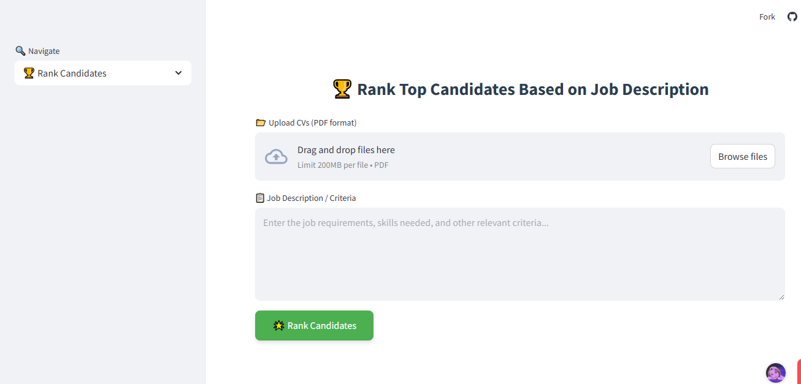

# RAG-Based Job Matching and Chat Application
 
## Overview

This project is a **Retrieval-Augmented Generation (RAG)** application designed to streamline the recruitment and candidate evaluation process. It allows users to:

* Upload multiple **CVs/resumes**.
* Extract the **top-N candidates** relevant to a specific **job description** using semantic search.
* **Chat interactively** about the shortlisted candidates, their qualifications, and their past projects using a powerful **LLM (Gemini)** integrated with **FAISS** for fast vector search.
 


## Key Features

* 📝 **CV Ingestion**: Upload CVs in PDF or text format. The system parses and embeds them for semantic retrieval.
* 💼 **Job Matching**: Input a job description and retrieve the **most relevant candidates** using similarity search.
* 💬 **Interactive Chat**: Ask questions like “Which candidate has experience in deep learning?” or “What projects has Candidate 3 worked on?” — and get answers generated by **Gemini**.
* ⚡ **Fast Search**: Uses **FAISS** (Facebook AI Similarity Search) for scalable vector search over the CV embeddings.
* 🔍 **LLM + Retrieval**: Combines **Gemini’s LLM** capabilities with CV context to produce accurate, grounded answers.

## Tech Stack

* **Language Model**: [Gemini LLM](https://deepmind.google/)
* **Vector Store**: [FAISS](https://github.com/facebookresearch/faiss)
* **Backend**: Python
* **Frontend**: Streamlit
* **Parsing**: PDF and text parsers (e.g., PyMuPDF, pdfplumber)
* **Embedding Model**: Gemini embedding API or sentence transformers

## How It Works

1. **Upload CVs**
   The user uploads a batch of CVs. These are parsed and converted into vector representations (embeddings).

2. **Indexing**
   The vectors are stored in a **FAISS index** for efficient retrieval.

3. **Job Query**
   The recruiter inputs a job description. The system transforms the query into a vector and retrieves the **top N** most relevant CVs.

4. **Chat**
   A chat interface allows the user to ask follow-up questions about candidates. Contextual answers are generated by the Gemini LLM based on retrieved CV content.


## Example Prompts

* “Show me the top 5 candidates for a data science role requiring NLP experience.”
* “Which candidate has experience working with TensorFlow?”
* “What are the most relevant projects from Candidate 2?”

## Project Structure

```
📁 rag-job-matcher/
│
├── data/               # Sample CVs
├── vectorstore.py      # FAISS index and embedding cache
├── app.py              # Main application file
├── utils.py            # Helper functions 
├── gemini_generate.py  # Chat wrapper with Gemini
├── requirements.txt
└── README.md
```

## Future Work

* 1. Adaptive Feedback Loop

Learn from recruiter ratings to improve matching


 2. Multilingual CV Support

Handle global recruitment at scale


 3. ATS Integration

Plug into existing HR systems

## 🎥 Demo Video
[Download and Watch the Video](project.mp4)

 
